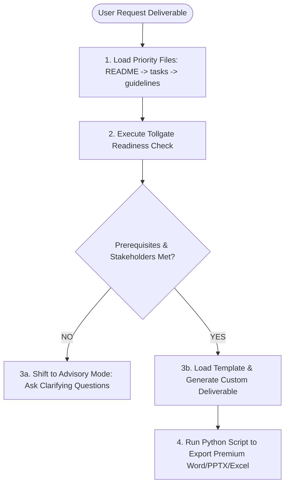

# 🚀 BABOK® V3 Business Analysis AI Assistant (Agent Skill Pack)

[](https://www.iiba.org/)
[](LICENSE)
[](SKILL.md)
[]()

An enterprise-grade, highly structured, and standards-compliant **AI Agent Skill Pack** for Business Analysis, engineered strictly around the **IIBA® BABOK® Guide v3 (A Guide to the Business Analysis Body of Knowledge)**. 

This repository transforms standard AI models into an expert, high-touch, C-level Business Analysis Assistant capable of executing analysis tasks, running pre-flight readiness checks, diagnosing situational techniques, and exporting premium, publication-ready corporate documents (.docx, .xlsx, .pptx).

---

## 🌟 Key Features

*   **🚦 Pre-flight Tollgate Readiness Check:** An automated diagnostic framework that prevents "hallucinated deliverables" by verifying prerequisite inputs, governance models, and stakeholder availability before document drafting begins.
*   **📂 File Priority Routing:** A rigid hierarchical file lookup rule that guides the AI Agent to establish strategic context, verify task purposes, review gotchas, and consult templates in sequence.
*   **📁 Premium Document Generation:** Integrated python-docx style engine designed to convert standard markdown analyses into highly formatted, corporate-styled Word deliverables (using executive navy palettes, thick left-bordered callout boxes, and clean zebra-striped tables).
*   **📚 Comprehensive BABOK v3 Map:** Mapped coverage across **Business Analysis Planning & Monitoring (KA3)**, **Elicitation & Collaboration (KA4)**, **Strategy Analysis (KA6)**, and **Requirements Analysis & Design Definition (KA7)**.
*   **🛠️ Top-15 Technique deep-dives:** Practical step-by-step execution guidelines for the top 15 BABOK techniques (such as Business Cases, Use Cases, Process Modelling, Decision Modelling, and Interface Analysis).

---

## 🏗️ Repository Architecture

The library is designed for absolute predictability, traceability, and high context-efficiency for AI Agents:

```text
babok-ba-assistant/
│
├── 📄 SKILL.md                 # Core AI Agent Skill & Operating Rules
├── 📄 new_architecture.md      # System & Integration Architecture Spec
├── 📄 README.md                # Repository Entrypoint & Presentation
│
└── 📁 references/              # The Knowledge & Template Library
    ├── 📁 advisor/             # Pre-flight checklists & workflow patterns
    ├── 📁 canonical/           # Large BABOK V3 mappings (loaded on demand)
    ├── 📁 dependencies/        # Input/Output catalogs & task dependency maps
    │
    ├── 📁 ka/                  # Knowledge Area (KA) Operating Guidelines
    │   ├── 📁 ka03-planning/   # Planning, governance, and engagement guides
    │   ├── 📁 ka04-elicitation/# Elicitation activity prep and execution
    │   ├── 📁 ka06-strategy/   # Business objectives, future state & risk analysis
    │   └── 📁 ka07-radd/       # Requirements architecture & design options
    │
    ├── 📁 scripts/             # Beautiful Office export and layout utilities
    │
    ├── 📁 techniques/          # Situation-based technique selectors & deep dives
    │   └── 📁 top-15/          # Detailed execution guides for 15 primary techniques
    │
    └── 📁 templates/           # BABOK-standard markdown templates for deliverables
        ├── 📁 ka03/            # BA Approach, Engagement, Information templates
        ├── 📁 ka04/            # Elicitation plans, Result trackers, Trackers
        ├── 📁 ka06/            # Business Cases, Current/Future State, Solution Scope
        └── 📁 ka07/            # Design Options, Requirements Architecture, Audits
```

---

## 🚦 The Core Engine: The Tollgate Rule

To maintain the highest level of professionalism and avoid the typical "AI boilerplate", this skill operates under a strict **Tollgate Rule**. 



### Response Header Enforcement
Every analytical interaction initiated by the AI Assistant begins with an executive metadata card mapping standard BABOK contexts:

```text
**📍 BABOK Context:** KA 6 – Strategy Analysis / Task 6.1 – Analyze Current State
**🎯 Technique / Approach:** Document Analysis (ID: 10.18) — Synthesizing existing Q&A
**🚦 Readiness Check:** Pass — Business Strategy and As-Is Performance Metrics validated
**📄 Deliverable:** Current State Description (Template: references/templates/ka06/current-state-description.md)
**⚠️ CBAP Gotcha:** Beware of relying solely on system logs; human SME feedback is vital to identify manual overhead.
```

---

## 📁 Premium Document Aesthetics (The Word Exporter)

Rather than exporting standard, unstyled Word files, this repository includes an advanced python-docx layout script (`references/scripts/export-to-office.py`) that applies top-tier corporate document designs:

*   **Executive Theme:** Professional dark navy blue primary headers (`#1B365D`) combined with steel blue accents (`#4A777A`).
*   **Dynamic Banner Headers:** The title page and primary headers feature thick accent bars.
*   **Premium Callout Boxes:** Blockquotes are parsed and converted into thick-bordered text containers (`4pt` left border, `#1B365D` fill) to isolate critical notes, warnings, or gotchas.
*   **Professional Tables:** Automatically strips vertical borders, applies clean horizontal gray borders, and incorporates alternating zebra-striping to maximize data readability.

---

## 💻 How to Use

### 1. Ingesting as an AI Agent Skill
If you are developing or using an AI coding workspace (like Cursor, VS Code Copilot, or Gemini Advanced):
1. Copy the folder structure into your agent's workspace.
2. Direct your agent to read `SKILL.md` before starting any business analysis work.
3. The agent will automatically reference the appropriate `references/ka/` folders, run readiness checks, and populate templates instead of guessing.

### 2. Exporting Markdown to Beautiful Word Documents
To compile a markdown analysis into a premium client-ready Word document:
```bash
python references/scripts/export-to-office.py --input path/to/your-file.md --format docx --out outputs/
```

---

## 📄 License

This project is licensed under the MIT License - see the [LICENSE](LICENSE) file for details.

---

<p align="center">
  <b>Developed by Vincent Phan</b> • Crafted for high-impact Business Analysts who value standard rigor, aesthetic excellence, and AI-driven automation.
</p>
