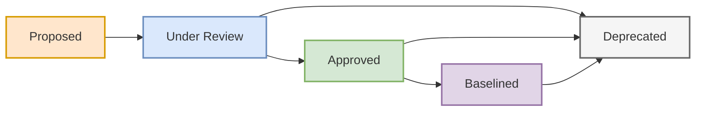

#### description: Entry point for KA05 Requirements Life Cycle Management. Provides context, task list (5.1-5.5), and dynamic routing instructions for the AI Agent to handle unified matrices and change requests.

### KA05: Requirements Life Cycle Management
**🤖 AI AGENT INSTRUCTION (DISPATCHER & TOLLGATE HOOK):** 
Use this document to set the control context. KA05 is NOT about writing new requirement descriptions (that is KA07); it is strictly about managing metadata, states, and relationships. 
**⚠️ CRITICAL:** Before executing any KA05 task, you MUST run the `readiness-check.md` Tollgate. Note that Tasks 5.1, 5.2, and 5.3 are executed continuously and their outputs are merged into unified Matrix templates. 

#### Purpose
To ensure that business, stakeholder, and solution requirements and designs are aligned to one another, that the solution implements them, and that they are maintained for future reuse.

#### Task List & Dynamic Routing (AI Agent Instructions)
**🤖 AI AGENT INSTRUCTION:** Read the user's request carefully and route to the correct output template based on these exact rules:

1. **Tasks 5.1 (Trace), 5.2 (Maintain), 5.3 (Prioritize):**
   * **Rule:** Do NOT create separate narrative documents for these tasks. They are merged.
   * **Routing:** Assess the *Level of Requirement* the user is asking about:
     * If Business/Strategic Level ➔ Load `references/templates/ka05/business-requirement-matrix.md`
     * If Solution/Functional Level ➔ Load `references/templates/ka05/functional-requirement-matrix.md`
     * If Quality/System Constraints ➔ Load `references/templates/ka05/non-functional-requirement-matrix.md`
     * If End-to-End full traceability ➔ Load `references/templates/ka05/requirement-traceability-matrix.md` (Master RTM)

2. **Task 5.4 Assess Requirements Changes:**
   * **Purpose:** Evaluates the implications of proposed changes to requirements and designs (Impact Analysis).
   * **Routing:** Load `references/templates/ka05/requirements-change-assessment.md` when the user mentions a new scope request, a changed business rule, or a delayed feature.

3. **Task 5.5 Approve Requirements:**
   * **Purpose:** Obtains agreement on and approval of requirements and designs.
   * **Routing:** Assess target audience and level of meeting:
     * If formal governance sign-off or approval package ➔ Load `references/templates/ka05/requirements-approval-package.md`
     * If presenting to Sponsors/C-Level/Board of Directors (BoD) for pitch/presentation ➔ Load `references/templates/ka05/executive-pitch-deck.md`

#### Requirements Status Lifecycle Map (Task 5.2 & 5.5)
To ensure consistent metadata tracking in all matrices, the AI Agent and Business Analyst MUST strictly use the following status lifecycle states for requirements:

*   **Proposed:** Requirement has been suggested by a stakeholder but not yet formally assessed.
*   **Under Review:** Requirement is undergoing impact analysis (Task 5.4) or detailed specification (KA07).
*   **Approved:** Requirement has been formally signed off by the Designated Change Authority (Task 5.5).
*   **Baselined:** Approved requirement has been locked into the project scope baseline for execution. Any changes from this point require a formal Change Request (Task 5.4).
*   **Deprecated:** Requirement is obsolete, rejected, or removed from scope. Stored for historical context and reuse research.

#### When to Use This KA
* **Scope Creep Prevention:** When stakeholders request new features midway through the project (Trigger Task 5.4).
* **Coverage Verification:** When testing begins and you need to prove every requirement has a Test Case (Trigger Task 5.1 via RTM).
* **Backlog Grooming:** When resources are constrained and you must determine which features to build first (Trigger Task 5.3).
* **Executive Sign-off:** When requirements are verified and validated, and funding authorization is required (Trigger Task 5.5).

#### 📂 Files in This Folder
| File | Role | When to Load |
| :--- | :--- | :--- |
| `README.md` | This file. Central dispatcher and context. | **Always load first.** |
| `tasks.md` | Task definitions: Purpose, Inputs, Outputs. | Load when executing or planning a specific task. |
| `guidelines-tools.md` | Pre-flight checklist: required Guidelines and Tools. | **Load alongside tasks.md** — mandatory before generating any artifact. |
| `stakeholders.md` | Defines Must Have, Should Have, Approval Authority. | **Load alongside tasks.md** — mandatory before engaging stakeholders. |
| `techniques.md` | Technique selection (e.g., Backlog Management, Decision Analysis). | Load only if the user asks HOW to perform a task. |
| `gotchas.md` | CBAP exam traps and common life cycle anti-patterns. | Load only if the user asks about risks, pitfalls, or exam prep. |
