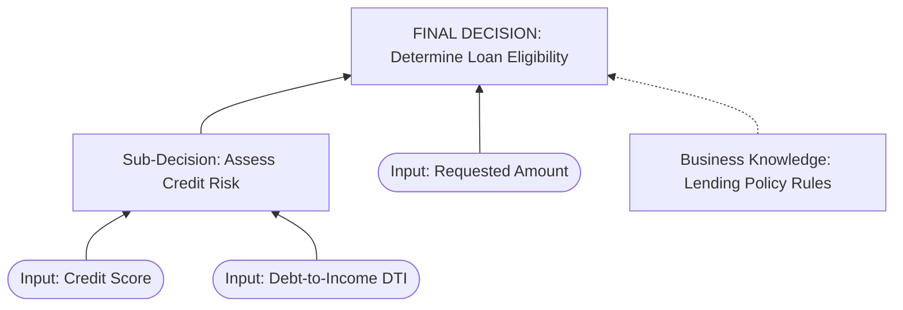

# Decision Modelling (BABOK 10.17)

## Overview

Decision Modelling visually maps how data inputs and business rules combine to execute a structured, repeatable business decision. It is governed by the DMN (Decision Model and Notation) standard. A decision model typically consists of:
- **Decision Requirements Diagram (DRD):** A visual model showing the dependency relationships between decisions, supporting inputs, and business knowledges.
- **Decision Tables:** Tabular representation of input rules and their corresponding outcomes, utilizing specific hit policies (e.g., Unique, First, Collect).

## When to Use

- User needs to model pricing engines, credit approvals, tax calculations, or complex validation systems.
- User wants to streamline high-volume operational decisions for automation.
- Task 6.2 (Define Future State), Task 7.1 (Specify and Model Requirements).

## Do not use when
- Describing step-by-step user tasks, manual operational procedures, or system workflows (use Process Modelling 10.35 instead).
- Designing the physical data fields and storage rules (use Data Dictionary 10.12 instead).

## Quick Reference

| DMN Component | Standard Representation | What it represents |
| :--- | :--- | :--- |
| **Decision** | Rectangle | The act of determining an output from inputs |
| **Input Data** | Rounded Rectangle (Oval-like) | Information used as an input to a decision |
| **Business Knowledge**| Rectangle with clipped corners | Rules or algorithms (e.g., standard formula) |
| **Hit Policy** | Letter prefix in Decision Table | E.g., **U** (Unique: only one rule can match) |
| **Primary KAs** | KA06, KA07 | |
| **Most common tasks** | Task 6.2 (Future State), Task 7.1 (Specify & Model) | |

## Step-by-Step for AI Agent

1. **Verify Context Inputs:** Identify the target decision output (e.g., "Determine Loan Eligibility Status") and the required inputs (e.g., "Credit Score", "Debt-to-Income Ratio").
2. **⚠️ SHARP NEGATIVE CONSTRAINT:** If the inputs or the logic rules connecting inputs to outputs are completely unknown, STOP. Request the business validation rules or policies from the user. Do not invent decision thresholds (like "Credit Score > 600") without stakeholder baseline rules.
3. **Draft the DRD Dependencies:** Map out which input variables feed into which sub-decisions, leading to the final decision.
4. **Choose Hit Policy:** By default, use **Unique (U)** where rules are mutually exclusive, or **First (F)** if rules have order-based priority.
5. **Construct the Decision Table:** Design a clean Markdown matrix showing inputs, output variables, and allowed value domains.
6. **Generate Output:** Present the DRD in Mermaid and the Decision Table as specified in the template.

---

## 🗺️ INPUT TRACEABILITY MAP

| Target Section | Required Input Element | Source Document / Reference | Requirement Type | Status |
| :--- | :--- | :--- | :--- | :--- |
| **Decision Output** | The clear, repeatable target outcome of the model | Business Requirements (Task 6.1) | Mandatory | [ ] Pending |
| **Input Variables** | Data fields needed to make the decision | Data Dictionary (Task 7.1) | Mandatory | [ ] Pending |
| **Logic Rules** | Conditional limits, scores, and policy guidelines | Business Rules Catalog (Task 7.1) | Mandatory | [ ] Pending |

---

## 🤖 AI AGENT INSTRUCTION (EXECUTION RULES)
- **Hit Policy Declaration:** Always explicitly declare the Hit Policy (e.g., "Unique", "First") at the top-left of the Decision Table.
- **Completeness Scan:** Verify that the Decision Table handles all possible input combinations. If a combination is unhandled, provide a default fallback rule.

---

## Template: Decision Model Specification

### 1. Decision Requirements Diagram (DRD)

### 2. Decision Table Specification

- **Decision Name:** [INSERT: Name, e.g., "Assess Credit Risk"]
- **Target Output Variable:** `credit_risk_tier` (Allowed: `['LOW', 'MEDIUM', 'HIGH', 'DECLINE']`)
- **Hit Policy:** **U** (Unique - exactly one rule will match the inputs)

| **U** | **Input: Credit Score** | **Input: Debt-to-Income (DTI)** | **Output: Credit Risk Tier** |
| :--- | :--- | :--- | :--- |
| **Allowed Value Domain** | `[300..850]` | `[0.00..1.00]` | `['LOW', 'MEDIUM', 'HIGH', 'DECLINE']` |
| **Rule 1** | `>= 720` | `< 0.35` | `LOW` |
| **Rule 2** | `[650..719]` | `< 0.45` | `MEDIUM` |
| **Rule 3** | `[600..649]` | `< 0.50` | `HIGH` |
| **Rule 4** | `< 600` | `-` | `DECLINE` |
| **Rule 5** | `-` | `>= 0.50` | `DECLINE` |

### 3. Sub-Decision & Input Definitions
- **[INSERT: Sub-Decision Name]:** [INSERT: Short text | Detail the operational purpose of this sub-decision | Business Rules]
- **[INSERT: Input Variable Name]:** [INSERT: Short text | What data element is fetched and its format | Data Dictionary]

---

## Common Mistakes & CBAP Gotchas

> **⚠️ AI AGENT INSTRUCTION:** If any of these traps are detected in the user's request, surface a `⚠️ CBAP Gotcha` alert before generating the output.

**Trap 1 — Overlapping Rule Inputs in Unique Hit Policy**
- Wrong: Rule 1: `Score > 600` -> Low Risk; Rule 2: `Score [550..650]` -> Med Risk. (If score is 610, both rules match, violating the Unique Hit Policy).
- Right: Ensure inputs are mutually exclusive: Rule 1: `Score > 650`; Rule 2: `Score [550..650]`.

**Trap 2 — Mixing Workflow Steps into DMN**
- Wrong: Including action nodes like *"Send email to customer"* inside the DMN DRD diagram.
- Right: Decisions in DMN only resolve data logic. Performing actions based on the resolved decision is the job of the BPMN workflow engine (Process Model). Keep DMN separate from BPMN.
