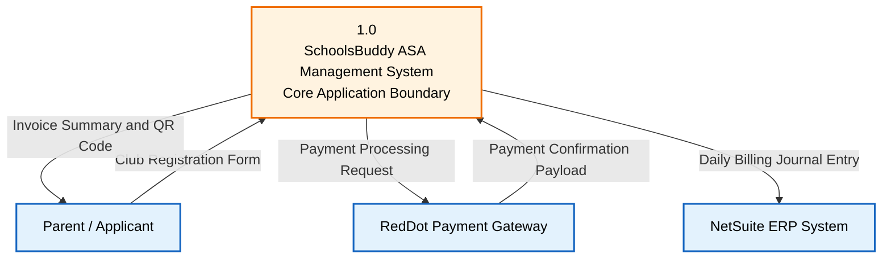
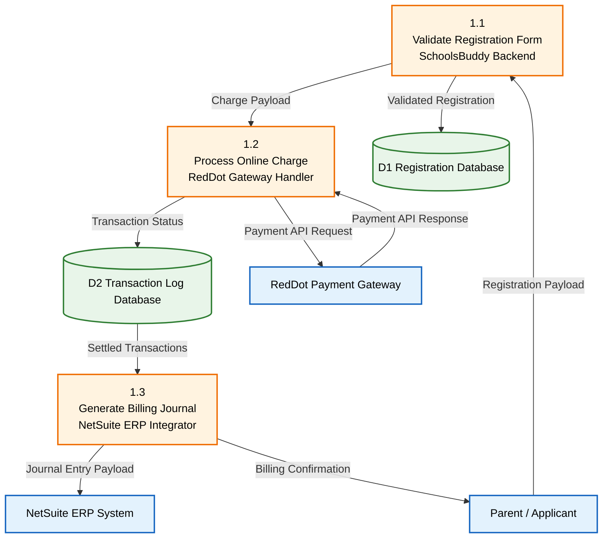

# Data Flow Diagrams (BABOK 10.13)

## 1. Overview & The Gane-Sarson Framework

A Data Flow Diagram (DFD) visually represents how data moves through an information system. It outlines the sources/destinations of data (External Entities), the transformations performed (Processes), the storage points (Data Stores), and the transmission paths (Data Flows). 

To ensure complete clarity and seamless integration with Draw.io and physical development teams, the AI Assistant **MUST** strictly utilize the **Gane-Sarson Notation** standard.

---

## 2. DFD Level Boundaries: Context Level vs. Level 1

To prevent diagrams from degrading into unreadable "spiderwebs" and to maintain a professional level of business abstraction, DFD modeling is strictly limited to the following two levels:

```text
Level 0 (Context Level): System Boundary, External Entities, NO Data Stores.
     │
     └── Level 1 DFD: Decomposes into 3 to 7 primary processes, introduces Data Stores.
          │
          └── ⛔ [ABSOLUTE BOUNDARY]: DO NOT exceed Level 1 (Level 2+ is the domain of Software Architects).
```

> [!IMPORTANT]
> **Quy tắc phân rã tiến trình & Mức độ trừu tượng hợp lý (User Comments & Alignment):**
> 1. **Break down đủ nhỏ:** Các tiến trình lớn phức tạp phải được chia tách thành các tiến trình con nhỏ hơn ở Level 1, đảm bảo mỗi tiến trình thể hiện rõ một chức năng đơn lẻ, dễ hiểu đối với cả phòng ban Kế toán, nghiệp vụ và Đội ngũ Phát triển kỹ thuật.
> 2. **Tuyệt đối không vượt quá Level 1 DFD:** Việc đi sâu hơn xuống Level 2, Level 3 (chi tiết hóa các bảng cơ sở dữ liệu vật lý hay vòng lặp logic) sẽ biến sơ đồ thành một "mạng nhện" rối rắm, phản tác dụng trong giao tiếp và thuộc về vai trò chuyên môn của Kiến trúc sư Phần mềm (Software Architect).

### A. Level 0: Sơ đồ ngữ cảnh (Context Level Diagram)
*   **Purpose:** Defines the complete organizational scope and system boundaries of the solution.
*   **Rigor Constraint:** Represents the entire system as a **single, central process node** (typically numbered `0` or `1.0`).
*   **Data Store Prohibition:** **Strictly NO internal Data Stores** are shown at the Context Level. Data stores are considered internal to the system boundary and are hidden from this view.
*   **External Entities:** Shows all external actors, external systems, or organizations interacting directly with the system.

### B. Level 1: Sơ đồ chi tiết chức năng chính (Process Decomposition)
*   **Purpose:** Decomposes the single central process of Level 0 into its primary functional sub-processes.
*   **Rigor Constraint:** Must contain between **3 and 7 child processes** (numbered `1.1`, `1.2`, etc.). More than 7 processes violates the cognitive clarity rule.
*   **Internal Data Stores:** Introduces internal databases, file logs, or cache layers (numbered `D1`, `D2`, etc.) representing data at rest.
*   **Absolute Depth Limit:** **BAs MUST NOT model beyond Level 1.** Further decomposition (Level 2 or 3 showing specific database table writes or loop iterations) over-complicates the requirement and duplicates architectural diagrams drawn by Software Architects.

---

## 3. Gane-Sarson Notation Specifications

When compiling a DFD, the AI Assistant must follow Gane-Sarson visual and semantic standards:

1.  **Process (Tiến trình - Rounded Rectangle):**
    *   Unlike DeMarco-Yourdon's simple circles, Gane-Sarson processes are rounded rectangles structured into three bands:
        *   *Top band:* Process ID/Number (e.g. `1.1`).
        *   *Middle band:* Process Name (must be an active verb + singular noun, e.g. `Verify Credit Limit`).
        *   *Bottom band:* Location, executing role, or automating system (e.g. `[NetSuite ERP]`, `[ASA Coordinator]`).
2.  **Data Store (Khay dữ liệu - Open-ended Rectangle):**
    *   Represented as a rectangle open on the right, divided into:
        *   *Left section:* Data Store ID (e.g. `D1`, `D2`).
        *   *Right/Main section:* Data Store Name (strictly a noun, e.g. `Student Registry DB`).
3.  **External Entity (Tác nhân ngoài - Square / Double-walled Square):**
    *   Represents an external entity (person, department, or external system) that is a source or destination of system data.
4.  **Data Flow (Luồng dữ liệu - Directed Arrow):**
    *   A directed arrow showing data in motion.
    *   *Rigor Constraint:* Data flows **MUST** represent actual data payloads moving between nodes. The label **must be a noun** (e.g., `Payment Payload`, `Verification Status`). Never use verbs for flow labels.

---

## 4. 🔌 Draw.io & Mermaid Rendering Engine (Gane-Sarson Style)

To draw Gane-Sarson DFDs that are **100% compatible** with the Draw.io Mermaid importer, the AI Assistant must apply these exact mapping guidelines:

### A. Process Node Representation
Since Mermaid Flowchart syntax does not natively draw horizontal bands inside rounded rectangles, we emulate Gane-Sarson process notation using highly structured multi-line labels:

```text
P1["1.1
Validate Registration Payload
[SchoolsBuddy Backend]"]
```
*Applying rounded capsule brackets `( ... )` or structured quotes `[" ... "]` matches the Gane-Sarson shape perfectly.*

### B. Data Store Node Representation
Emulate the split Gane-Sarson data store using a structured, pipe-separated format inside a standard rectangular shape:

```text
DS1["D1 | Registration Database"]
```

### C. Connection & Quote Rules
*   Every node label **must** be enclosed in double quotes `""` to prevent Draw.io compilation crashes on spaces, line breaks (`\n`), and Vietnamese accents.
*   Data flows are modeled using standard arrow syntax `-->| "Data Label" |`.

---

## 5. DFD Syntactical Integrity (The Golden DFD Laws)

Data Flow Diagrams process data and are subject to strict structural laws. The AI Assistant **must** reject any model containing the following illegal flows:

```text
⛔ ILLEGAL: External Entity ───────X───────> External Entity (Must pass through a Process)
⛔ ILLEGAL: Data Store      ───────X───────> Data Store      (Must pass through a Process)
⛔ ILLEGAL: External Entity ───────X───────> Data Store      (Must pass through a Process)
```

1.  **No Direct Entity-to-Entity Communication:** External entities cannot exchange data directly within the system scope. If they do, that communication path is outside the boundary of our system.
2.  **No Direct Store-to-Store Communication:** Data cannot move directly from one database to another. It requires a Process node to read from one store, process/transform, and write to the other.
3.  **No Direct Entity-to-Store Communication:** External actors cannot write to or read from system databases directly. They must interact with a Process node (e.g., a screen action or API controller) that performs the database operation.
4.  **The "No Black Hole" Rule:** Every Process node must have at least one incoming data flow. A process with outputs but no inputs is a "Miracle" (impossible data generation).
5.  **The "No Miracle" Rule:** Every Process node must have at least one outgoing data flow. A process with inputs but no outputs is a "Black Hole" (data disappears without utility).

---

## 🚦 Gane-Sarson DFD Verification Checklist

- [ ] **Boundary Compliance:** Level 0 contains strictly **one** central system process and NO data stores.
- [ ] **Depth Compliance:** Under no circumstances does the model decompose beyond Level 1.
- [ ] **Structural Validity:** Zero instances of Entity-to-Entity, Store-to-Store, or Entity-to-Store direct data flows.
- [ ] **Input/Output Integrity:** Zero "Black Holes" and zero "Miracles" among process nodes.
- [ ] **Gane-Sarson Labeling:**
    *   Processes have an ID, an active verb-noun name, and an execution owner (role/system).
    *   Data Stores have a unique D-number and a database name.
    *   Data flow labels are strictly nouns (payloads), never verbs.
- [ ] **Mermaid-Draw.io Compatibility:** All labels are double-quoted; Gane-Sarson process bands are emulated using multi-line text strings.

---

## Template: Gane-Sarson DFD Specification

### 1. DFD Level 0 (Context Level Diagram)



### 2. DFD Level 1 (Process Decomposition)
*Limited to 3 - 7 processes. Strictly no Level 2+ diagrams.*



### 3. DFD Elements Catalog

#### A. External Entities Inventory
- **Parent / Applicant:** External user role who fills registration forms and makes online credit card payments.
- **NetSuite ERP System:** External accounting downstream ledger which imports daily transaction journals.

#### B. Internal Data Stores Inventory (Level 1)
- **D1 | Registration Database:** Holds validated student club registrations, schedules, and active bookings.
- **D2 | Transaction Log Database:** Tracks credit card transaction payloads, reference codes, signature verification keys, and settlement statuses.

#### C. Data Flows Catalog
- **DF-101 (Parent -> Process 1.1):** Payload contains Student ID, selected club codes, and registration timestamp.
- **DF-102 (Process 1.1 -> Store D1):** Validated registration payload written to the registry database.
