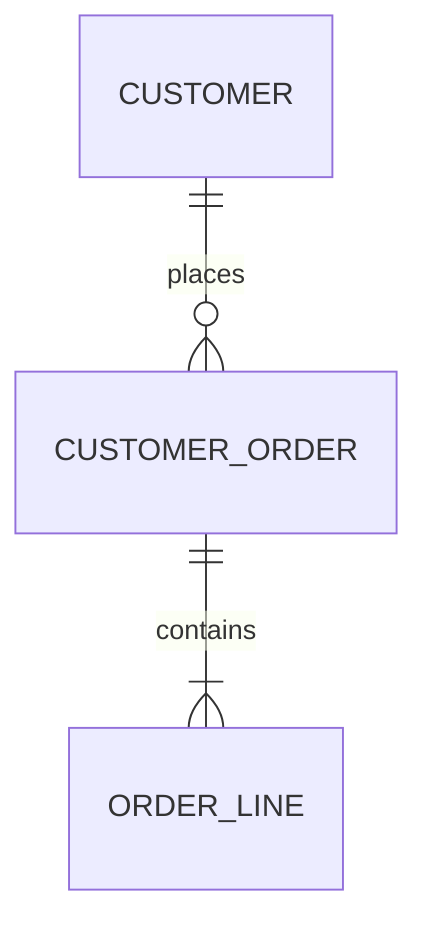
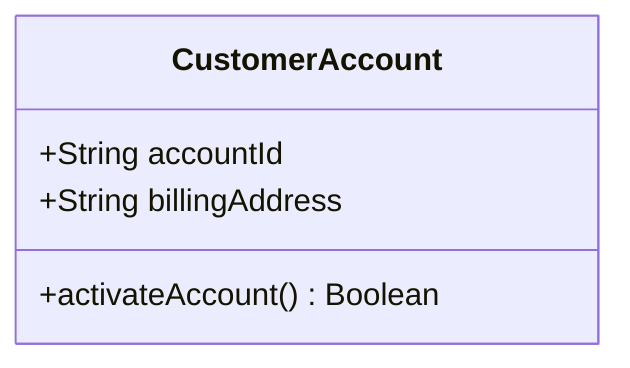
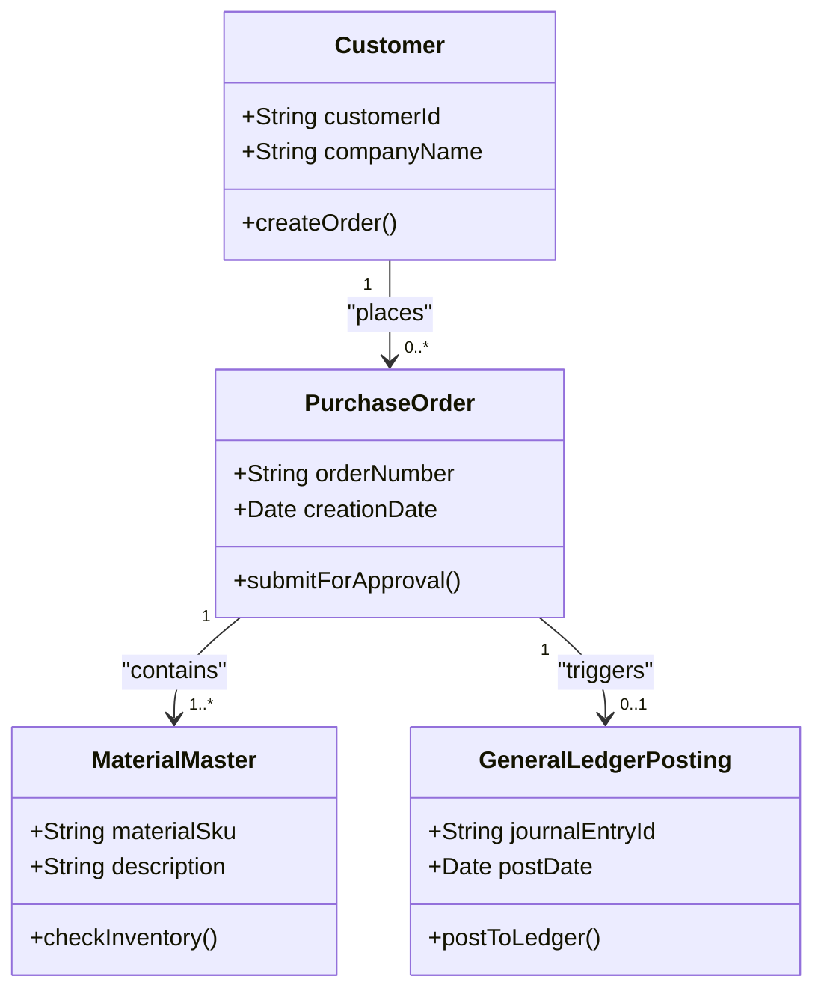
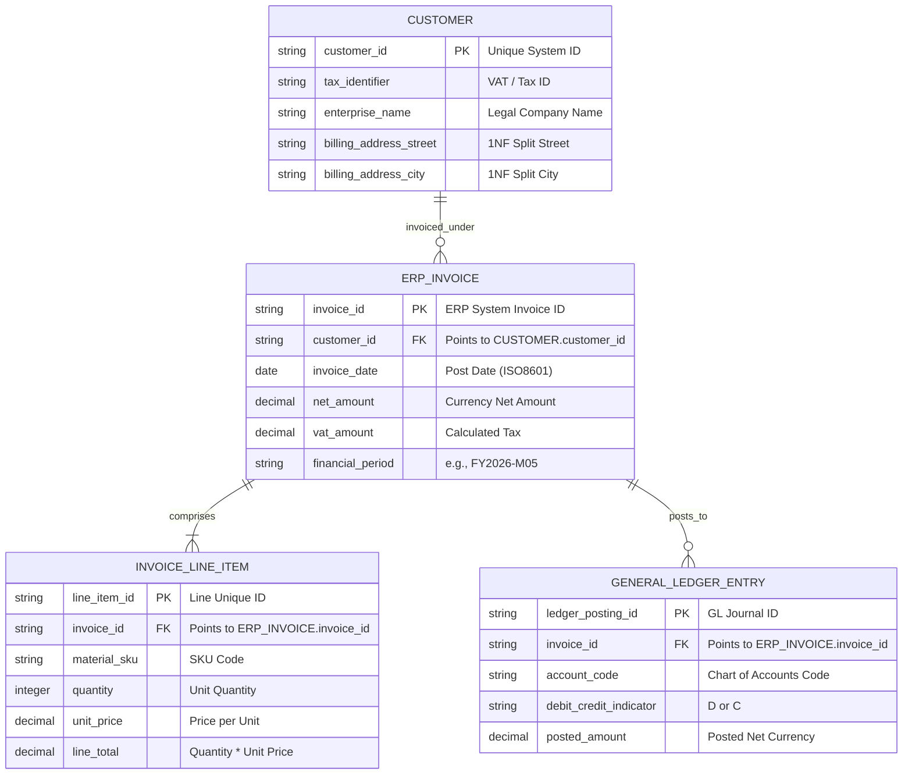

# Data Modelling (BABOK 10.15)

## 1. Overview & Architectural Boundaries

A Data Model visually describes the entities, classes, or data objects relevant to a business domain, their associated attributes, and the relationships linking them. It establishes a common, unambiguous semantics for business vocabularies, ensuring that domain experts, systems integrators, and developers share a single conceptual model.

To prevent requirements from degrading into database-tuning exercises, Business Analysts **MUST** strictly operate within the following two levels of abstraction:

```text
Conceptual Data Model: Business Vocabulary, Core Entities, Semantic Associations (No Keys/Attributes)
     │
     └── Logical Data Model: Normalized Entities, Attributes, Keys (PK/FK), and Cardinalities (1NF/2NF/3NF)
          │
          └── ⛔ [ARCHITECTURAL BOUNDARY]: DO NOT define Physical Data Models (DDL, Indexes, Partitioning)
               - Physical modeling is the exclusive domain of IT Architects & Database Engineers.
```

### A. Conceptual Data Model (Business Vocabulary)
*   **Purpose:** Establish a consistent business vocabulary and define the high-level boundary of domain concepts.
*   **Rigor Constraint:** Highly abstract. Focuses on identifying the core enterprise concepts (e.g., *Customer*, *Contract*, *Ledger*) and their basic semantic connections.
*   **Out-of-Scope:** Strictly **NO** database-specific attributes, primary/foreign keys, or normalization schemas are shown at this stage.

### B. Logical Data Model (Normalized Structure)
*   **Purpose:** Formally document the business rules, data integrity constraints, and exact relationships independent of any specific database technology (e.g., SQL, NoSQL).
*   **Rigor Constraint:** Incorporates rigorous logical structures including attributes, data types, Primary Keys (`PK`), Foreign Keys (`FK`), and strict cardinalities.
*   **Normalization Rule:** Must be normalized up to **Third Normal Form (3NF)** to ensure transactional integrity, which is especially critical for financial ledger and ERP systems.

---

## 2. Notation Specifications

When compiling a Data Model, the AI Assistant **must** strictly utilize one of the two standard notations depending on the business objective:

### A. Crow's Foot Notation (Logical ERD Standard)
The standard for relational database modeling and transactional structures (e.g., standard relational ERPs like SAP and Oracle):
*   **Entities:** Represented as standard rectangular tables with an optional header section for the entity name.
*   **Attributes:** Grouped into key fields (Primary and Foreign Keys) and non-key fields.
*   **Cardinality Symbols:**
    *   **Exactly One:** `||` (Mandatory, Single)
    *   **One or Many:** `|{` (Mandatory, Multiple)
    *   **Zero or One:** `o|` (Optional, Single)
    *   **Zero or Many:** `o{` (Optional, Multiple)

### B. UML Class Diagram (Logical Object-Oriented Standard)
The standard for object-oriented software engineering, software service architectures (APIs), and domain-driven design:
*   **Class Box:** Divided into three distinct bands:
    1.  *Top Band:* Class Name.
    2.  *Middle Band:* Attributes with access modifiers and types (e.g., `+ customerId: String`).
    3.  *Bottom Band:* Operations or methods that the class can perform (e.g., `+ activateBillingAccount(): Boolean`).
*   **Multiplicity Notation:** Represented at the association ends using standard numeric markers:
    *   `1` (Exactly One)
    *   `0..1` (Zero or One)
    *   `*` or `0..*` (Zero or Many)
    *   `1..*` (One or Many)

---

## 3. 🔌 Draw.io & Mermaid Rendering Engine Integration

To ensure that all data models generated are **100% compatible** with the Draw.io Mermaid importer and render flawlessly without parsing errors, the AI Assistant **MUST** strictly adhere to the following syntax rules:

### A. Crow's Foot ERD Syntax (Draw.io Stable)
*   Do not use spaces in entity names. Use PascalCase or UPPER_SNAKE_CASE (e.g., `CUSTOMER` or `ORDER_LINE`).
*   Explicitly define Primary Keys (`PK`) and Foreign Keys (`FK`) inside brackets `""` to escape spaces.
*   Keep relation verbs short and enclose them in double quotes `""` to prevent Draw.io compilation crashes.



### B. UML Class Diagram Syntax (Draw.io Stable)
*   Use standard `class` declarations with explicit visibility markers (`+` for public, `-` for private).
*   Encapsulate multi-word associations inside quoted strings `""`.
*   Ensure all brackets match perfectly.



---

## 4. Syntactical Integrity & Normalization Laws

Every Logical Data Model compiled **must** satisfy the golden laws of data integrity to prevent data anomalies:

1.  **First Normal Form (1NF):**
    *   All attributes must contain only atomic (indivisible) values.
    *   No repeating groups or multi-valued attributes are allowed (e.g., do not store multiple comma-separated addresses in a single `billingAddress` field; split into an `ADDRESS` entity).
2.  **Second Normal Form (2NF):**
    *   Must satisfy 1NF.
    *   All non-key attributes must be fully functionally dependent on the entire Primary Key. If the Primary Key is composite, attributes cannot depend on only a subset of the key.
3.  **Third Normal Form (3NF - Crucial for ERP and Ledgers):**
    *   Must satisfy 2NF.
    *   No transitive dependencies are allowed. Non-key attributes must depend directly on the Primary Key, and only on the Primary Key ("the key, the whole key, and nothing but the key").
    *   *Example:* An `ORDER` entity cannot store the `salesRepName` directly if it depends on `salesRepId`. Move the sales representative data to a dedicated `SALES_REP` entity to ensure ledger and reporting accuracy.
4.  **Foreign Key Constraint Law:**
    *   A foreign key attribute in a child entity **must** point to a valid Primary Key in the parent entity. No orphan records are allowed.

---

## 🤖 5. AI Agent Elicitation Interview Protocol

> [!CAUTION]
> **ANTI-HALLUCINATION SHIELD (CRITICAL FOR GEMINI AGENTS):**
> **DO NOT** fabricate database tables, create arbitrary key relationships, or guess the cardinality rules of an ERP system. 
> Hallucinating a data model leads to catastrophic downstream system mismatches, broken integrations, and incorrect data mappings.

If any business concept, attribute description, unique identifier, or cardinality rule is missing, the AI Agent **MUST** immediately halt template generation, shift to **Advisory Mode**, and initiate a highly focused **AI-to-User Elicitation Interview** using the script below:

### The Elicitation Interview Script
> *"To ensure your data model is production-ready, standardized, and accurately aligns with your enterprise architecture, I need to clarify some core business rules. Please answer these brief questions:*
> 1.  **Core Scope:** What are the 3 to 5 core business entities (e.g., Customer, Contract, Invoice, Ledger Posting) we are modeling?
> 2.  **Unique Identifiers (Primary Keys):** How does your enterprise uniquely identify each of these entities in your systems (e.g., ERP-generated Account Number, standard UUID)?
> 3.  **Multiplicity & Business Rules:** What are the exact cardinality rules in both directions? (e.g., *Can a Customer exist without an active Order? Can an Invoice relate to multiple Orders?*)
> 4.  **Integration Boundaries:** Which system acts as the absolute **Source of Truth (Upstream)** for these entities, and which systems consume them (Downstream)?"*

---

## 🚦 Data Modelling Verification Checklist

- [ ] **Boundary Compliance:** The model represents strictly **Conceptual** (business vocabulary) or **Logical** (normalized structures) schemas. Zero physical database DDL, partition configurations, or indexes are included.
- [ ] **ERP Domain Context:** Entities are named using standard, professional ERP and corporate finance terminology (e.g., `LEDGER_POSTING`, `ACCOUNTS_RECEIVABLE`, `MATERIAL_MASTER`).
- [ ] **Standard Compliance:**
    *   UML Class Diagrams include explicit types (`String`, `Date`), visibility modifiers (`+`, `-`), and operations.
    *   ERDs strictly utilize Gane-Sarson standard Crow's Foot cardinality indicators (`||`, `|{`, `o|`, `o{`).
- [ ] **Normalization Integrity:** The logical model is verified up to **Third Normal Form (3NF)** with no transitive dependencies or multi-valued repeating groups.
- [ ] **Draw.io Import Compatibility:** All entities and relationship labels are double-quoted; Mermaid code is tested and syntactically clean to ensure zero crashes.
- [ ] **Anti-Hallucination Verified:** If any schema connection was uncertain, the Elicitation Interview was triggered first instead of guessing.

---

## Template & Production-Ready Examples

### 1. Conceptual Data Model (UML Class Diagram & Business Vocabulary)
*Focuses on high-level enterprise concepts and associations. Attributes and operational methods are kept at a business level.*



### 2. Logical Data Model (ERD with Crow's Foot Notation & 3NF Normalization)
*A normalized Logical ERD for an enterprise ERP billing integration, showing clear primary and foreign key mapping.*



---

## 3. Data Element Catalog (ERP Billing Integration Context)

### A. Customer Entity
*   **Description:** Represents the legal business entity that buys products/services and is billed under corporate accounting terms.
*   **Data Elements:**
    *   `customer_id` (Primary Key): Standard alphanumeric identifier assigned by the upstream ERP system (e.g., NetSuite/SAP).
    *   `tax_identifier`: Standard national corporate tax registration code used for legal financial audits.
    *   `billing_address_street` & `billing_address_city`: 1NF decoupled components of the physical address to ensure clean sorting and localized billing.

### B. ERP Invoice Entity
*   **Description:** The official billing ledger document issued by the organization to record Accounts Receivable.
*   **Data Elements:**
    *   `invoice_id` (Primary Key): Sequential legal financial reference generated upon invoice posting.
    *   `customer_id` (Foreign Key): Direct association mapping the invoice to a registered customer.
    *   `net_amount`: Decimal field recording invoice value excluding tax.
    *   `vat_amount`: Decimal field recording the calculated sales tax.
    *   `financial_period`: Alphanumeric calendar code representing the accounting period for reporting.

### C. General Ledger Entry Entity (Downstream Integration)
*   **Description:** The double-entry posting record submitted to the Chart of Accounts for company balance sheet reconciliation.
*   **Data Elements:**
    *   `ledger_posting_id` (Primary Key): Unique ledger document sequence number.
    *   `invoice_id` (Foreign Key): Direct lineage trace proving the invoice source.
    *   `account_code`: Chart of Accounts identifier mapping the transaction to Cash, Accounts Receivable, or Revenue.
    *   `debit_credit_indicator`: Enforce binary state ('D' or 'C') matching accounting double-entry regulations.