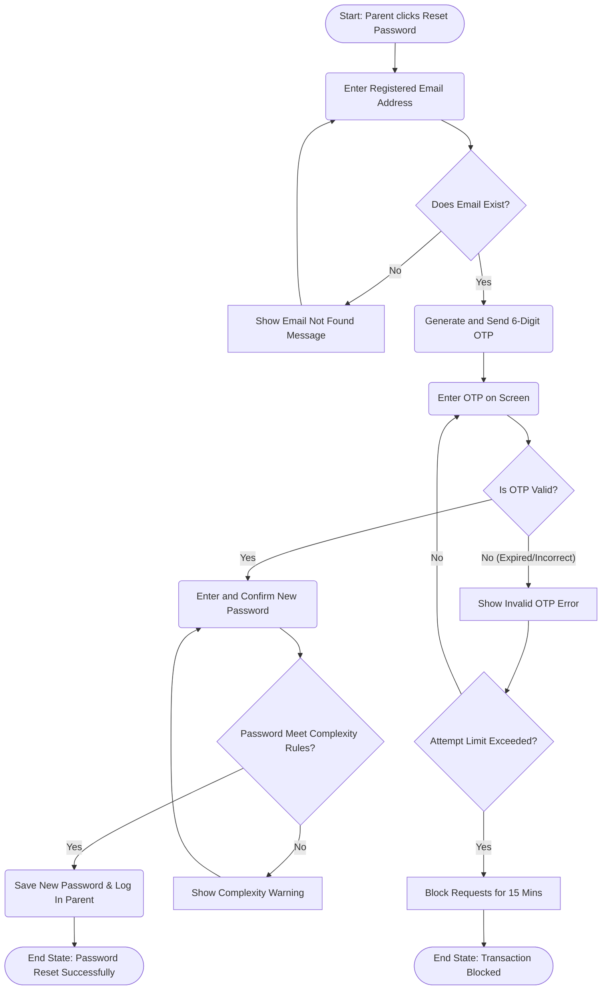
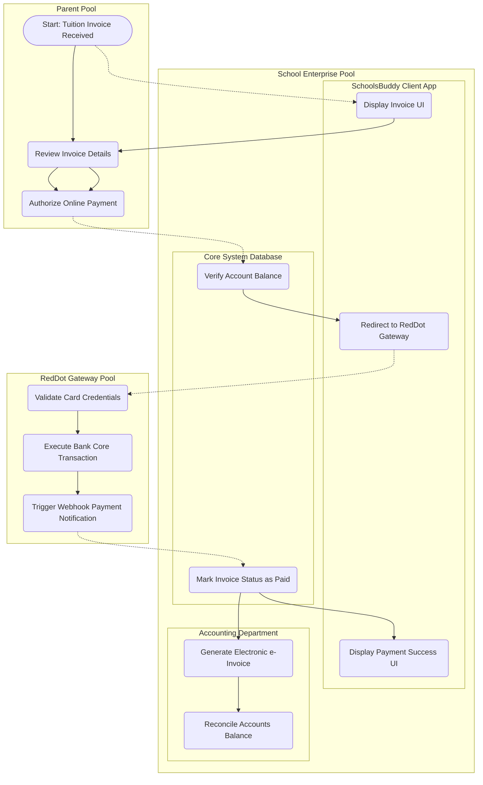
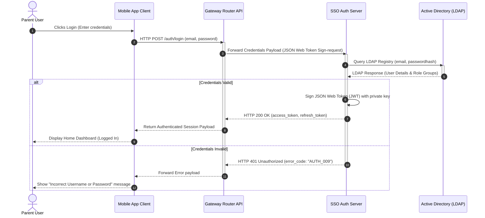

# Process Modelling High-Fidelity Examples

This reference document contains three high-fidelity, production-grade examples representing standard real-world operational scenarios in EdTech and Enterprise systems.

---

## Example 1: Standard Flowchart / User Flow (EdTech Password Reset)

### 1. Business Scenario
A parent attempts to reset their forgotten password on the SchoolsBuddy Mobile App. The system must verify their registered email address, trigger a time-limited OTP code, validate their input, permit them to write a new password complying with security standards, and handle any validation errors or timeout scenarios gracefully.

### 2. Mermaid Diagram (Draw.io Compatible)

---

## Example 2: BPMN 2.0 Diagram (Tuition Payment Flow)

### 1. Business Scenario
The school accounting system generates a quarterly tuition invoice. The parent reviews the invoice on SchoolsBuddy and executes an online payment via the RedDot payment gateway. The gateway validates credentials, queries the bank core, processes the payment, and throws a webhook response. The school accounting lane catches the payment confirmation, marks the invoice paid, and generates an official electronic invoice (e-invoice). If a timeout occurs, a timer event triggers transaction cancellation.

### 2. Pool & Lane Allocation Matrix
*   **Pool A: Parent Pool (Customer)** - Lane: Parent Actor.
*   **Pool B: School Enterprise Pool** - Lanes: SchoolsBuddy Client App, Core Database Engine, Accounting Department.
*   **Pool C: Bank Payment Portal Pool (External)** - Lane: RedDot Payment Gateway.

### 3. BPMN 2.0 Conceptual Diagram (Mermaid)

---

## Example 3: UML Sequence Diagram (Enterprise Single Sign-On - SSO)

### 1. Business Scenario
A high-fidelity system interaction sequence diagram detailing how a mobile application verifies user identity via an Enterprise Active Directory (LDAP) server using a JSON Web Token (JWT) exchange.

### 2. UML Sequence Mermaid Specification

