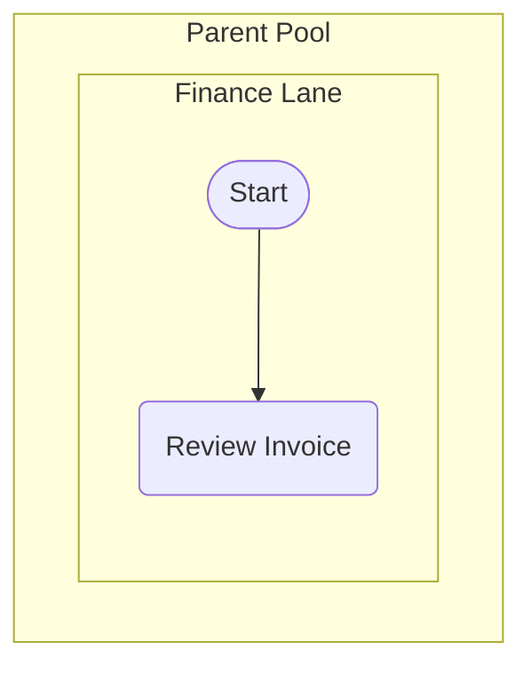

# BPMN 2.0 Process Specification

## 1. BPMN Process Metadata
*   **Process Name:** [Insert: E.g., "Parent Tuition Fee Payment Process"]
*   **BPMN Scope:** [Insert: E.g., "SchoolsBuddy system, RedDot Payment Gateway, School Accounting System"]
*   **Process Owner:** [Insert: Role responsible for the end-to-end process]
*   **Primary Trigger Event:** [Insert: E.g., "Invoice Generated (Start Event)"]
*   **End States:**
    *   *Success End:* [E.g., "Tuition Marked Paid"]
    *   *Failure End:* [E.g., "Transaction Canceled & Notified"]

---

## 2. Process Diagram
*   **Draw.io XML File Link:** [Insert: Link to generated file, e.g., file:///c:/path/to/outputs/my-bpmn.drawio]
*   **Standard BPMN Markdown Visualization:**

---

## 3. Pool & Swimlane Matrix

| Pool Name | Swimlane (Internal Role) | System / Owner | Responsibilities in Process |
| :--- | :--- | :--- | :--- |
| **[Pool A]** | [Lane A1] | [Actor/System] | [Role's primary actions in this lane] |
| **[Pool B]** | [Lane B1] | [Actor/System] | [Role's primary actions in this lane] |

---

## 4. BPMN Event & Gateway Logs

### A. Event Log (Start, Boundary, and End Events)
| Event ID | Event Type | Trigger / Condition | Placement / Boundary | Operational Behavior |
| :--- | :--- | :--- | :--- | :--- |
| **EV-01** | [Start / Timer / Message / Error] | [What triggers this event?] | [Pool/Lane or Task attached] | [System behavior when triggered] |

### B. Gateway & Exception Logic Table (Branching Rules)
| Gateway ID | Gateway Type | Evaluation Rule (Guard Condition) | Outgoing Path A | Outgoing Path B | Exception / Escalation Flow |
| :--- | :--- | :--- | :--- | :--- | :--- |
| **GW-01** | [Exclusive XOR / Parallel AND / Inclusive OR] | [What business rule or attribute is evaluated?] | [Path A & condition] | [Path B & condition] | [What happens if evaluation fails?] |

---

## 5. Detailed BPMN Activity Catalog

| Activity ID | Swimlane / System | Activity Type | Activity Name & Description | Primary Inputs | Primary Outputs |
| :--- | :--- | :--- | :--- | :--- | :--- |
| **ACT-01** | [Lane Name] | [User Task / Service Task / Sub-Process] | **[Activity Title]:** [Detailed operational description] | [Inputs] | [Outputs] |
