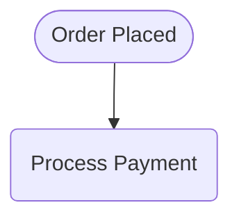

# Process Model Specification

## 1. Process Metadata
*   **Process Name:** [Insert: E.g., "SchoolsBuddy Payment Online Integration"]
*   **Target Standard:** [Insert: Standard Flowchart / BPMN 2.0 / UML Activity Diagram]
*   **Target Audience:** [Insert: E.g., "Chief Accountant, System Engineers, and QA Team"]
*   **Process Owner:** [Insert: E.g., "Finance Department / Tech Lead"]
*   **Process Trigger:** [Insert: Event that initiates the workflow]
*   **Primary Success Outcome:** [Insert: Desired end state when the process completes successfully]

---

## 2. Process Diagram
*   **Draw.io XML File Link:** [Insert: Link to generated file, e.g., file:///c:/path/to/outputs/my-process.drawio]
*   **Standard Markdown/Mermaid Visualization:**

---

## 3. Process Steps Catalog

| Step ID | Owner (Role/System) | Step & Description | Inputs | Outputs | Decision / Exception Rules |
| :--- | :--- | :--- | :--- | :--- | :--- |
| **P-01** | [Role or System name] | **[Step Title]:** [Detailed operational description of what is performed] | [Data or trigger starting the step] | [Data or trigger produced] | [Rules for exceptions or branching conditions] |
| **P-02** | [Role or System name] | **[Step Title]:** [Detailed operational description of what is performed] | [Data or trigger starting the step] | [Data or trigger produced] | [Rules for exceptions or branching conditions] |

---

## 4. Related Documents & Data Entities

| Document / Entity Name | Format / Source | Description | Key Attributes / Payload Fields |
| :--- | :--- | :--- | :--- |
| **[E.g., Payment Payload]** | [E.g., JSON / Webhook API] | [Description of what the payload contains and its purpose] | [E.g., transactionId, amount, status, checkSum] |
